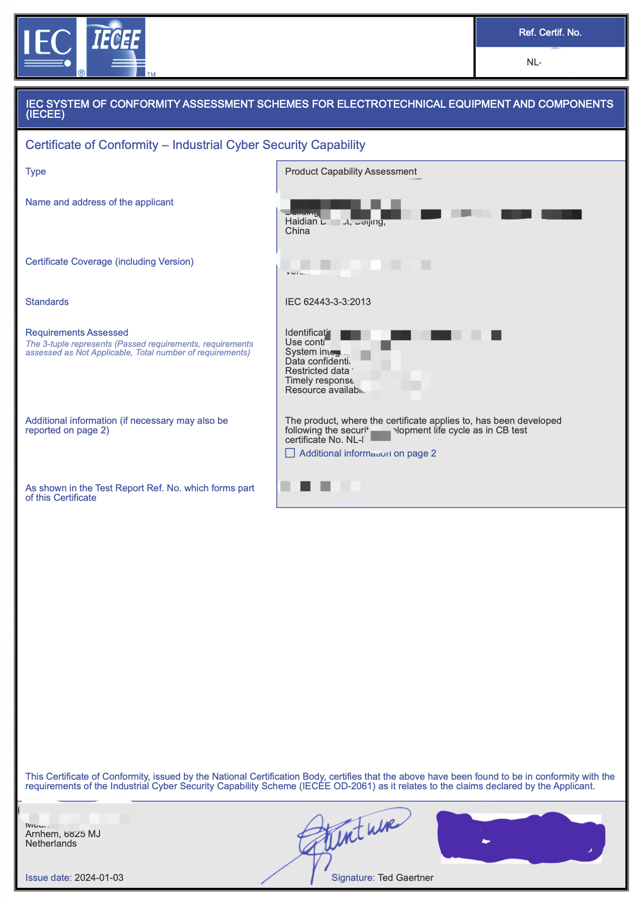

我所在的公司从事港口无人水平运输业务, 通俗讲就是在港口用无人车拉集装箱. 具体作业场景包括装船, 卸船, 堆场间移箱. 港口中的无人车属于工业机械, 不属于常见的商用车. 控制平台收到港口操作系统(TOS)的收箱/送箱指令之后对无人车进行调度, 并给出行驶路线, 无人车按迹行驶. 在此过程中存在多个系统之间的配合:
1. TOS系统负责根据船图和堆场图计算装卸箱顺序, 并将指令发送给相应的工程机械
2. 无人车负责执行水平运输任务
3. 龙门吊负责垂直运输任务
4. 我所在的云控部门负责无人车流程调度
5. V2X负责路侧感知

水平运输系统使用的网络在分类上属于工业控制网络, 包括单车无线接入, 5G基站, 接入/汇聚/核心有线网络, 防护软硬件设备, 身份认证, 审计, 跟踪等各种模块. 在某成规模的港口中, 功能模块比较齐全, 整体的网络方案是由我牵头设计的. 2023年3月我司启动了IEC62443工控网络安全的认证工作, 在当时这属于国内港口领域第一张无人运输的网络安全国际认证. 认证过程充满各种挑战, 在证书取得一年半后, 以此文记录认证过程中的一些细节, 希望能够对别人有所帮助.

整个认证过程可以分为: 启动认证 -> 学习认证相关的知识 -> 按照要求进行改造 -> 认证机构按照标准进行验证 -> 提交认证材料 -> 整改 -> 下证.

启动认证

IEC总部在荷兰, 在国内有代理结构, 我司聘请了南方某代理机构负责认证工作. 代理机构有两种代理模式: 认证, 认证 + 咨询. 前者代理机构只负责按照要求对系统进行验证, 后者还包含在认证过程中的辅导. 我司为了省钱只购买了认证服务. 启动认证时, 代理机构来了两个人, 一个负责技术, 一个负责商务, 对我司的负责认证具体工作的同事, 也包括我, 进行宣讲. 宣讲的内容主要包括认证的过程, 认证的内容, 认证机构和我们的合作方式. 总共花了一天时间.

学习认证相关的知识

在了解了相关认证的大概内容之后, 我们要先学习IEC62443 3-3的标准知识, IEC62443 3-3标准是一个90页的PDF文件. 对工控网络的各种安全相关功能提出了要求. 3-3的各个要求分为4个不同的等级. 要根据认证的等级决定每个功能应该达到什么样的强度. 例如SR 1.2对Level 2的要求是要能够识别系统内的所有软硬件, 也就是系统内只存在允许存在的软硬件. 而Level 3 则更进一步要求对每一个独立的软硬件都有唯一的标识.

总结下来, IEC62443 3-3一共有100条左右的工控网络安全要求, 分成: 身份识别和验证, 系统使用控制, 系统完整性, 数据保密性, 数据可控性, 系统可用性, 6个大的方面. 每个方面有10~20条具体的要求. 我们进行的是Level 2的认证, 因此基本上100条要求里只要有相应的功能即可. 对功能强度的要求没有过多的限制.

按照要求进行改造

我们花了大部分时间在系统改造和准备认证材料上. 因为3-3提出了100条相关要求, 因此必须挨个对照, 进行安全功能的增改查. 认证小组有4名技术人员负责具体改造工作, 整个认证过程怨声载道. 我作为主要负责人, 不仅要负责整体进度的推进, 还要当大家的垃圾桶. 大家有什么脾气, 怨气都倒到我这里. 我也知道这事儿不好干, 但只能忍着, 给大家提供足够的情绪价值. 有些改造的内容比较小, 比较容易做. 但是有些改造的内容是大家的知识盲区, 不容易做. 做起来也不情不愿. 我只能牵头设计技术方案, 协调不同的小组一起完成. 在这个过程中也是对我的一次推进复杂项目的考验.

认证机构按照标准进行验证

我方首先要在认证机构可访问的网络中提供测试环境. 测试环境中需要部署此次认证的所有组件, 并包含3-3要求的所有功能. 认证机构通过远程的方式对系统进行测试, 验证系统是否具备3-3相应Level的要求. 其中包含了软件工程过程的验证, 安全功能的自动化测试和手工测试. 软件过程的验证就是按照62443 4-1的要求, 检查系统开发, 运行, 维护过程中是否符合标准的4-1流程. 安全功能的自动化测试就是认证机构的技术负责人跑一些测试程序, 挖掘系统中存在的漏洞等. 手工测试是技术负责人自己尝试攻击系统, 并且检查系统中是否具备了3-3要求的安全功能, 例如日志格式的要求, 登录验证的要求, psirt的要求等.

提交认证材料

在完成了代理机构的验证之后就相当于过了功能这一关. 但是现在要过文档这一关了. 3-3要求的文档之细超出了日常开发的需要. 对于我们从互联网企业转过来的同事而言, 所需要提交的认证材料有些过分规范了. 不过这些文档也包含在软件工程的定义当中. 有需求文档, 设计文档, 实现文档, 测试文档, 各种文档的各种文档, 需求管理文档, 用户文档, 运维手册等各种文档都要齐备. 其实在以前开发的时候并没有这么规范, 因此对于系统中已经存在的各种功能需要补充很多文档. 产品相关的文档 就交给产品经理负责了. 系统分析设计相关的文档, 实现, 测试等就由我们几个技术同事负责. 这个过程也是很磨人的, 大概花了半年时间, 边做项目需求边写这些文档.

整改

整改是一个理论上存在的过程, 是将材料提交到国外之后, 如果有什么地方不符合要求, 就要打回来重新修改. 好在我们的文档写的比较完整, 因此一次性的通过了.

下证

之后就等了两个月拿到了正式的证书.

回顾整个认证的过程, 有几点体会.
1. 认证机构是认真的
认证机构会逐条按照3-3的要求和系统的功能进行对比. 不要存在侥幸心理. 有一条不符合要求都是不行的. 每个要求自己看文档有可能理解的不深刻, 所以可以即时向认证机构的老师请教. 请教的时候要厚脸皮, 或者不要脸. 问多了人家肯定烦, 而且我们并没有付咨询费, 所以为了把认证做完, 我只能不要脸, 追着老师问.
2. 认证过程是磨人的
开始做认证的时候我没想到整个过程是如此的磨人. 作为整个项目的负责人, 我要面对项目成员的消极情绪, 承接认证机构老师测出来的问题, 为各种安全功能寻找技术方案, 搭建测试环境等等. 别人都可以甩脸子, 撂挑子, 我却不能, 我只能耐着性子, 好言相劝, 耐心沟通, 花时间学习再教给同事.
3. 拿到证书是很有成就感的
在2023年底完成所有材料之后, 认证机构提前告诉我们应该可以了, 之后就是等荷兰方签署证书. 得知消息的时候心里总算松了口气. 接近两年的时间终于见到了成果. 项目组成员因为各种原因换了一大半, 最终一路坚持下来的只有3个人. 困难的事情都是不好做的, 人和人的一个重要区别就是能不能耐住性子, 持续的往前顶, 而大部分人顶着顶着就放弃了.
4. 过程中不断拓展自己的舒适区, 获得了很多知识和经验
我不是学安全专业出身, 很多安全功能是如何实现的, 底层原理是什么, 解决了什么问题, 最佳实践是什么, 其实我一开始都不知道. 但是其他成员也不知道, 所以我只能硬着头皮顶上去. 这一段时间密集的学习了很多安全领域相关的知识. 还有就是软件工程相关的开发流程相关的实践. 在之前的工作经历中都不那么正规, 这次人家是要求一定要满足4-1软件工程相关流程. 所以也算是出了学校之后第一次如此正规的完成大型项目的面向过程的软件工程.
